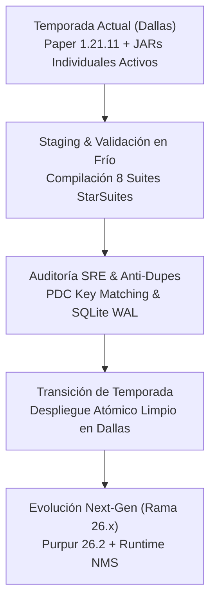

<p align="center">
  
</p>

<div align="center">

# 🌌 StarSuites (Monorepo Drakes-Suites) — Rama `main`

### Arquitectura Maestra de Suites concebida por JackStar para el Ecosistema de Minecraft & Sistemas
**Consolidación Oficial de 180+ Plugins en Suites Autónomas para Paper 1.21.11+ (Temporada Activa & Próxima Temporada)**

[](https://github.com/DrakesCraft-Labs/Drakes-Suites)
[](https://papermc.io/)
[](https://openjdk.org/)
[](https://www.rust-lang.org/)
[](https://sqlite.org/)
[](https://github.com/DrakesCraft-Labs)

[🏛️ Suites Oficiales](#-desglose-canónico-de-las-suites) ·
[⚙️ Configuración Modular](#️-estándar-de-configuración-modular-modulesyml) ·
[⚠️ Directiva de Desarrollo](#️-directiva-canónica-de-desarrollo-permanente) ·
[🔒 Clasificación Dallas](#-clasificación-canónica-de-plugins-en-dallas-plugins) ·
[🚀 Hoja de Ruta](#-hoja-de-ruta-de-temporadas)

</div>

---

> ### 🛡️ Estado de la Rama: `main` (Producción Estable Paper 1.21.11)
> Esta rama es la fuente canónica de verdad para el stack **Paper/Purpur 1.21.11** en Java 21, correspondiente a la temporada activa del servidor de juego en Dallas.  
> **Rama Next-Gen:** Para el sandbox de próxima generación portado a **Purpur 26.2**, consulta la rama [`26.x`](https://github.com/DrakesCraft-Labs/Drakes-Suites/tree/26.x).

---

## 🌟 1. Los Tres Pilares de Ingeniería Soberana

Este monorepo forma parte del ecosistema unificado de ingeniería de software de **JackStar (Jack)**:

1. 🏫 **Tecnología Educativa e Infraestructura Institucional:** Ingeniería de software y redes de campus privadas, automatización de infraestructura, diagnósticos y plataformas de gestión escolar.
2. ⭐ **Star / JackStar:** Arquitectura soberana de software, orquestador autónomo de SRE **SAORI**, evolución del motor Odysseia a **Star Engine** y autoría de **StarSuites**.
3. 🐉 **DrakesCraft:** Servidor multijugador masivo de Minecraft en producción (Dallas, TX), comunidad de jugadores, economía macroeconómica dinámica y panteones mitológicos.

> ℹ️ **Reconocimiento Canónico Upstream (Slimefun):**  
> Slimefun original es una colosal obra open-source concebida por **TheBusyBiscuit** y mantenida por su comunidad histórica. **JackStar no es el creador original de Slimefun**, sino el arquitecto de modernización técnica: rescate de rendimiento crítico en Paper 1.21.11, erradicación de 70+ tickers asíncronos duplicados, aceleración off-heap en Rust ([`Slimefun-Rust`](https://github.com/DrakesCraft-Labs/Slimefun-Rust)) y consolidación masiva de 180+ micro-repositorios en las suites oficiales.

---

## 🏛️ 2. Desglose Canónico de las Suites

El ecosistema StarSuites reemplaza más de 160 plugins individuales dispersos por **8 Mega-Suites oficiales** más la Suite soberana Multiverse:

| Suite | Artefacto JAR | Dominio Técnico | Sistemas y Plugins Consolidados |
| :--- | :--- | :--- | :--- |
| **Suite 0** | `drakes-core.jar` | Kernel & Motor Central | Slimefun4-Drake runtime, Dough-core shadeado, Ticker centralizado (`SuiteTickerEngine`), JNI Bindings Rust (`NativeEngineBridge`), DB SQLite WAL y Logs de Auditoría. |
| **Suite 1** | `drakes-tech.jar` | Logística & Redes Digitales | Redes logísticas (Networks), almacenamiento cuántico por celdas masivas, InfinityExpansion, DynaTech, FastMachines, Supreme, Nanotech, FluffyMachines. |
| **Suite 2** | `drakes-bio.jar` | Biogenética & Campo | GeneticChickengineering (Tiers 0 a 9 con clonación y empalme genético), ExoticGarden, Cultivation, SlimyBees, MobCapturer. |
| **Suite 3** | `drakes-magic.jar` | Arcano & Alquimia | AlchimiaVitae, Crystamae, RelicsOfCthonia, SoulJars, Netheopoiesis, transmutación elemental, runas y rituales taumatúrgicos. |
| **Suite 4** | `drakes-generators.jar` | Matriz Energética | LiteXpansion, SMG, UltimateGenerators2, EcoPower, OreChunks, reactores solares, reactores nucleares y celdas de vacío. |
| **Suite 5** | `drakes-utility.jar` | Utilidades & QoL | DyedBackpacks, ColoredEnderChests, ChestTerminal, SFCalc, SlimeHUD, visualizadores holográficos y guías interactivas. |
| **Suite 6** | `drakes-combat.jar` | Arsenal & Combate | DrakesBosses, SlimeTinker, SlimefunWarfare, ExtraGear, LuckyBlocks, Galaxyfun, exoesqueletos balísticos y mitigación cinética. |
| **Suite 7** | `drakes-server.jar` | Servidor Standalone (Star) | **Evolución Odysseia -> Star**: Motor central de servidor, puente Rust/Java (`Star-Rust`), InvSwitcher (aislamiento de 5 modalidades), PlayerVaultZ, AxGraves, BreweryX, Mercado dinámico, economía y chat. |
| **Suite Multiverse** | `drakes-multiverse.jar` | **Autoría Soberana: Chagui68** | Absorbe `MultiverseCreatures` (criaturas mitológicas, bosses temáticos, rituales y dimensiones) y `MultiverseNets` (redes digitales standalone sin Slimefun). |

---

## ⚙️ 3. Estándar de Configuración Modular (`modules/*.yml`)

Cada Mega-Suite erradica los archivos de configuración monolíticos e inmanejables de 10,000 líneas. Toda la funcionalidad se desacopla en sub-módulos autónomos administrados por `AbstractSuiteModule` y `SuiteModuleManager`:

```
plugins/
├── DrakesCore/
│   ├── config.yml                # Configuración del kernel, telemetría y SuiteTickerEngine
│   └── modules/
├── DrakesTech/
│   ├── config.yml                # Master switch y perfiles de rendimiento tecnológico
│   └── modules/
│       ├── networks.yml          # Cables, ancho de banda y transferencia por tick
│       ├── dynatech.yml          # Máquinas dinámicas y generadores cuánticos
│       ├── infinity.yml          # Fórmulas de singularidades y recetas de Infinity
│       ├── supreme.yml           # Maquinaria Supreme y overclockers
│       └── fastmachines.yml      # Multiplicadores de velocidad y buffers
├── DrakesBio/
│   ├── config.yml
│   └── modules/
│       ├── genetic_chickens.yml  # Tiers 0-9, mutaciones genéticas, tasas de drop e incubadoras
│       ├── exotic_garden.yml     # Crecimiento de cultivos y botánica
│       └── slimy_bees.yml        # Panales, genética apícola y miel
├── DrakesMagic/
│   ├── config.yml
│   └── modules/
│       ├── alchimia_vitae.yml    # Calbazas de transmutación y elixires
│       ├── crystamae.yml         # Rituales cristalinos y resonadores
│       └── relics_cthonia.yml    # Reliquias del abismo y sacrificios
├── DrakesGenerators/
│   ├── config.yml
│   └── modules/
│       ├── litexpansion.yml      # Reactores y generadores de vacío
│       └── ultimategenerators.yml# Tasas de Joules (J/t) y disipación térmica
├── DrakesUtility/
│   ├── config.yml
│   └── modules/
│       ├── backpacks.yml         # Mochilas tintables de alta capacidad
│       └── chest_terminal.yml    # Rango de acceso inalámbrico e indexación
├── DrakesCombat/
│   ├── config.yml
│   └── modules/
│       ├── warfare.yml           # Armamento táctico, municiones y balística
│       ├── slimetinker.yml       # Modificadores de piezas, aleaciones y filo
│       └── extragear.yml         # Armaduras reactivas y mitigación
└── DrakesServer/
    ├── config.yml
    └── modules/
        ├── star_engine.yml       # Telemetría Star, puente Rust nativo y SQLite
        ├── invswitcher.yml       # Aislamiento estricto de inventarios por modalidad
        ├── playervaultz.yml      # Bóvedas virtuales seguras
        └── breweryx.yml          # Destilería y fermentación personalizada
```

### Recarga en Caliente Granular:
Los módulos pueden activarse, desactivarse y recargarse individualmente sin reiniciar el servidor:
```bash
/drakessuites reload <suite> [modulo]
```

---

## ⚡ 4. Ticker Engine Centralizado (`SuiteTickerEngine`)

Los addons ya no instancian bucles Bukkit `runTaskTimer` desacoplados que saturan el hilo principal (`Server thread`).  
El motor unificado `SuiteTickerEngine` en `DrakesCore`:
1. **Agrupación Espacial por Chunks:** Organiza los bloques activos por chunks cargados en memoria.
2. **Descarta Ticks en Chunks Inactivos:** Elimina llamadas repetitivas y costosas a NBT/PDC cuando no hay jugadores cerca.
3. **Reducción de Sobrecarga:** Reduce en un **~65-80% el uso de CPU** comparado con 160 plugins individuales corriendo tareas Bukkit asíncronas dispersas.

---

## 🛡️ 5. Compatibilidad Retroactiva y Cero Pérdida de Datos

- **Preservación Estricta de Claves PDC:** Los identificadores en `slimefun:slimefun_item` se mantienen 100% idénticos a los addons originales (ej. `NETWORKS_CABLE`, `INFINITY_SINGULARITY`, `GCE_CHICKEN_T9`, `SLIMETINKER_TINKERS_WORKBENCH`).
- **Persistencia Transaccional SQLite WAL:** Migración limpia sin pérdidas de inventarios, terminales ni cofres de jugadores en Dallas.

---

## ⚠️ 6. DIRECTIVA CANÓNICA DE DESARROLLO PERMANENTE

> ### 🛑 LEY SUPREMA PARA DESARROLLADORES Y AGENTES SRE (ANTIGRAVITY / CODEX / CLAUDE):
> A partir de la consolidación de StarSuites, **TODO** desarrollo, corrección de bugs (`fix`), incorporación de recetas o ítems (`feat`), parches de balance, optimizaciones de rendimiento y adaptaciones a Paper 1.21.11+ o Purpur 26.X para **CUALQUIERA de los plugins y addons absorbidos** debe realizarse **EXCLUSIVAMENTE DENTRO DE ESTE MONOREPO (STARSUITES)**.
> 
> * **NO tocar repositorios individuales antiguos:** Los 180+ micro-repositorios en `DrakesCraft-Labs` quedan formalmente archivados (*Read-Only*).
> * **Compilación Reactor Unificada:** Todo el proyecto compila en bloque con un único comando: `mvn clean package`.
> * **Aislamiento por Módulos:** Cada cambio debe documentarse en su respectivo `modules/<modulo>.yml` y clase modular `AbstractSuiteModule`.

---

## 🔒 7. Clasificación Canónica de Plugins en Dallas (`/plugins` — 167 Plugins)

En el servidor de producción (**Dallas**), coexisten cuatro categorías de software que ningún agente ni desarrollador debe confundir jamás:

1. **Mega-Suites StarSuites (Monorepo `Drakes-Suites`):**
   - Consolida y reemplaza los 160+ plugins y addons sueltos por los 8 JARs oficiales (`drakes-core` hasta `drakes-server`) más la suite soberana `drakes-multiverse` de Chagui68.
   - **`drakes-server.jar` (Star Engine):** Evolución canónica de Odysseia a **Star**. Kernel unificado de servidor, telemetría Star, verificación idempotente de compras Tebex (`purchases.db`), vigilancia de economía macroeconómica (SII) y puente Rust nativo.
   - **Estrategia Operativa de Temporada:**
     - **Temporada Actual (Producción Viva):** Se mantienen los JARs individuales activos en Dallas para no interrumpir a los jugadores y erradicar cualquier riesgo de pérdida de inventarios.
     - **Siguiente Temporada:** StarSuites se desplegará de forma atómica y limpia al inicio de la nueva temporada tras exhaustivas pruebas en staging.

2. **Forks Soberanos de la Organización (`DrakesCraft-Labs` - Open Source):**
   - Proyectos de código abierto que Jack mantiene, compila y parchea con lógica propietaria adaptada al stack Paper 1.21.11+:
   - **`BentoBox-Drake`**: **NO es cerrado.** Fork oficial soberano del motor de islas (BSkyBlock, OneBlock, CaveBlock, AcidIsland) con el parche crítico anti-destrucción de ítems de Paper Data Components en `ItemStackTypeAdapter` (Incidente #276).
   - **`CrazyAuctions-Drake`**: Subastas de jugadores (`/ah`) adaptadas al stack moderno sin bugs de duplicación de GUI.
   - **`DrakesSlimeMarket`**: Motor macroeconómico dinámico (`/sm`), con 777 ofertas controladas y suavizado exponencial.
   - **`AxGraves-Drakes`**, **`WorldwideChat-Drake`**, **`PlayerVaultZ-Drake`**, **`BreweryX-Drake`**, **`Inventory-Rollback-Plus-Drake`**, **`DrakesBosses`**, **`MultiverseCreatures`**, **`DrakesRankup`**, **`ExcellentCrates-Drake` (`DrakesCrates`)**, **`LevelledMobs-Drake`**.

3. **Plugins Comerciales / Closed-Source / Binarios Licenciados (Licenciados por Jack):**
   - Plugins comerciales adquiridos legítimamente para la red, cuyas configuraciones YAML y bases de datos se preservan íntegramente:
   - **`nLogin` (NickUC):** Licencia permanente de por vida pagada por Jack. Autenticación empresarial anti-bot, cifrado moderno de credenciales y soporte Java/Bedrock. Acompañado de **`nAntiBot`**.
   - **`TAB` (NEZNAMY):** Versión premium para tablist avanzada, prefijos de rangos y sincronización Bedrock/Geyser.
   - **`UltimateShop` (PQguanfang):** Tiendas GUI comerciales y transacción comunitaria multi-idioma.
   - **`SlotMachine`**: Juegos de azar y entretenimiento con Dragmas.
   - **`StaffPlus` / `StaffPlusPlus`**: Suite administrativa de moderación, inspección y congelamiento.
   - **`LibsDisguises Premium`**: Transformación y disfraces para eventos y jefes.
   - **`ModelEngine` & `FancyNpcs`**: Modelos 3D interactivos y NPCs de modalidades.
   - **`DeluxeMenus`**: Menús interactivos personalizados (`/menu`, `/rangos`, `/minas`).
   - **`GrimAC`**: Anti-cheat predictivo por paquetes.
   - **Plataforma de Red:** `WorldGuard`, `CoreProtect`, `InteractiveChat`, `MiniMOTD`, `ChatGames`, `Geyser-Spigot`, `Floodgate`, `DiscordSRV`.
   - **Directriz Canónica:** NO son código abierto ni deben ser descompilados a la fuerza. Viven como archivos JAR en `/plugins`.

4. **Componentes Nativos Híbridos en Rust (Off-Heap / FFM Java 21):**
   - **`Slimefun-Rust` (`libslimefun_ffi.so`):** Grafos logísticos (Networks/Cargo) y matrices de energía SIMD sin pausas de Garbage Collector.
   - **`Star-Rust` / `Odysseia-Rust` (`libodysseia_ffi.so`):** `RedstoneClockGuard` (detección y throttling de loops), `ChatFilterEngine` de alto rendimiento y evaluación de auras divinas 3D.

---

## 🚀 8. Hoja de Ruta de Temporadas



---

<div align="center">

**Diseñado y Construido con Orgullo por JackStar (Jack) y la Tríada Simétrica SRE**  
*DrakesCraft · Star Systems · Todos los derechos reservados*

</div>