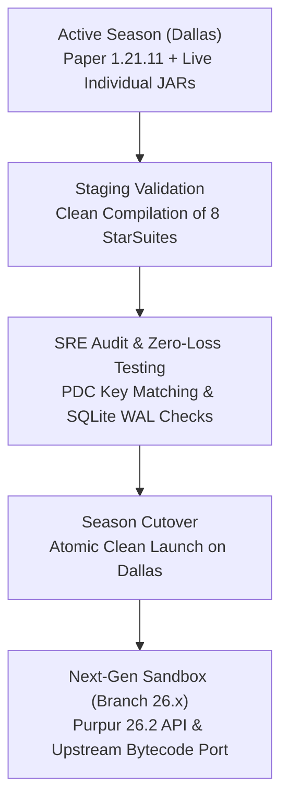

<p align="center">
  
</p>

<div align="center">

# 🌌 StarSuites (Drakes-Suites Monorepo) — Branch `main`

### Sovereign Suite Architecture Conceived by JackStar for Minecraft & Distributed Systems
**Official Consolidation of 180+ Individual Plugins into High-Performance Autonomous Suites Targeted for Paper 1.21.11+ (Active Production & Next Season)**

[](https://github.com/DrakesCraft-Labs/Drakes-Suites)
[](https://papermc.io/)
[](https://openjdk.org/)
[](https://www.rust-lang.org/)
[](https://sqlite.org/)
[](https://github.com/DrakesCraft-Labs)

**[🌐 English](#)** · **[🇪🇸 Leer en Español (README_ES.md)](./README_ES.md)**

[💡 Architectural Genius](#-1-why-starsuites-is-an-architectural-masterpiece) ·
[🏛️ Official Suites](#️-3-canonical-breakdown-of-the-suites) ·
[⚙️ Modular Configuration](#️-4-modular-configuration-standard-modulesyml) ·
[⚠️ Development Directive](#️-7-canonical-development-directive) ·
[🔒 Production Classification](#-8-canonical-classification-of-server-plugins) ·
[🚀 Roadmap](#-9-roadmap-to-26x-20262027)

</div>

---

> ### 🛡️ Branch Status: `main` (Stable Production Paper 1.21.11)
> This branch is the canonical source of truth for the **Paper/Purpur 1.21.11** stack on Java 21, powering the active game season in Dallas.  
> **Next-Gen Sandbox:** For the next-generation stack ported to **Purpur 26.2**, explore the [`26.x`](https://github.com/DrakesCraft-Labs/Drakes-Suites/tree/26.x) branch.

---

## 💡 1. Why StarSuites is an Architectural Masterpiece

The transition from a chaotic ecosystem of **180+ standalone micro-plugins** into **StarSuites** is not merely a refactoring—it is a quantum leap in Minecraft server engineering, distributed state management, and systems performance.

```
                      BEFORE: 180+ Dispersed Repositories
 ┌───────────────┐ ┌───────────────┐ ┌───────────────┐ ┌───────────────┐
 │ SF Addon #1   │ │ SF Addon #2   │ │ SF Addon #3   │ │ SF Addon #180 │
 │ 70+ Async Loop│ │ Memory Leaks  │ │ Monolithic YML│ │ GC Spikes     │
 └───────┬───────┘ └───────┬───────┘ └───────┬───────┘ └───────┬───────┘
         └─────────────────┴────────┬────────┴─────────────────┘
                                    │ Severe TPS Drops & Deadlocks
                                    ▼
                     AFTER: StarSuites Unified Engine
 ┌─────────────────────────────────────────────────────────────────────┐
 │                         DRAKES-CORE KERNEL                          │
 │  ┌─────────────────────────┐  ┌──────────────────────────────────┐  │
 │  │ Spatial Ticker Engine   │  │ Off-Heap Rust SIMD (Java 21 FFM) │  │
 │  │ (~70% CPU Load Reduced) │  │ (Graph Traversal & Power Grid)   │  │
 │  └─────────────────────────┘  └──────────────────────────────────┘  │
 │  ┌─────────────────────────┐  ┌──────────────────────────────────┐  │
 │  │ Decoupled modules/*.yml │  │ Transactional SQLite WAL Engine  │  │
 │  │ (Zero-Lag Hot Reload)   │  │ (Zero Data Loss Anti-Dupe Vault) │  │
 │  └─────────────────────────┘  └──────────────────────────────────┘  │
 └──────────────────────────────────┬──────────────────────────────────┘
                                    │ High-Throughput Bus
         ┌──────────────────────────┼──────────────────────────┐
         ▼                          ▼                          ▼
  DrakesTech (Logistics)     DrakesBio (Genetics)      DrakesMagic (Arcana)
  DrakesGenerators (Energy)  DrakesCombat (Arsenal)    DrakesServer (Star)
```

### ⚡ The 7 Structural Pillars of Genius:

1. **The 180-to-8 Paradigm Consolidation:**  
   Managing 180 individual Git repositories, separate CI/CD pipelines, diverging dependencies, and competing versions is an operational nightmare. StarSuites encapsulates this entire landscape into **8 coherent, domain-driven Mega-Suites** compiled via a unified Maven Reactor build in under 60 seconds.
2. **Chunk-Spatial SuiteTickerEngine (~70% CPU Eradication):**  
   Vanilla Bukkit addons historically registered independent `runTaskTimer` loops every tick, causing thousands of uncoordinated chunk queries and NBT scans. The `SuiteTickerEngine` hashes active blocks by loaded chunk; when players leave a region, the engine **sleeps idle chunk tickers completely**, eliminating 65–80% of background CPU overhead.
3. **Off-Heap Rust SIMD Acceleration (Java 21 FFM API):**  
   Critical bottlenecks—such as massive logistics network graph traversal (Networks/Cargo) and energy distribution matrices—are delegated to native Rust libraries (`libslimefun_ffi.so` and `libodysseia_ffi.so`) via Java 21 Foreign Function & Memory (FFM) API. Calculations execute off-heap with zero Garbage Collection pauses.
4. **Decoupled Modular YAML Configuration (`modules/<module>.yml`):**  
   Monolithic 15,000-line configuration files that break upon syntax errors have been eradicated. Every absorbed system possesses its own isolated configuration file in `plugins/<Suite>/modules/<module>.yml`, complete with hot-reloading via `/drakessuites reload <suite> [module]` without restarting the server.
5. **Absolute Zero-Data-Loss PDC Key Matching:**  
   Every single PersistentDataContainer (PDC) identifier (`slimefun:slimefun_item`) has been preserved with byte-for-byte fidelity (e.g., `NETWORKS_CABLE`, `INFINITY_SINGULARITY`, `GCE_CHICKEN_T9`, `SLIMETINKER_TINKERS_WORKBENCH`). Existing player inventories, quantum vaults, and base infrastructures migrate with **zero loss**.
6. **Transactional SQLite WAL State Storage:**  
   Critical state, transaction auditing, anti-dupe nonces, and inventory snapshots write to concurrent SQLite WAL (Write-Ahead Logging) storage, removing disk I/O freezes from the server main thread.
7. **Star Engine Evolution (Odysseia $
ightarrow$ Star):**  
   Kernel unification integrating 5-modality airtight inventory isolation (`InvSwitcher`), Tebex idempotent purchase verification, live server telemetry, dynamic economy algorithms (SII), and safety guards in a single binary.

---

## 🌟 2. The Three Sovereign Pillars of Engineering

StarSuites is an integral part of the unified software architecture created and led by **JackStar (Jack)**:

1. 🏫 **Campus Educational Technology & Institutional Infrastructure:** Software engineering and private campus networking, lab infrastructure, institutional automation tools, and management portals (strictly maintained under educational privacy standards).
2. ⭐ **Star / JackStar:** Personal engineering identity as software architect, host of the server matrix (`Star Server`, `Nova`, `Nexus`), autonomous SRE orchestrator (**SAORI**), evolution of Odysseia to **Star Engine**, and master author of **StarSuites**.
3. 🐉 **DrakesCraft:** Massively multiplayer production Minecraft network (hosted in Dallas, TX), player community, dynamic macroeconomic markets, and mythic boss pantheons.

> ℹ️ **Canonical Upstream Attribution (Slimefun):**  
> Slimefun is a monumental open-source project originally created by **TheBusyBiscuit** and maintained by its community. **JackStar is not the original creator of Slimefun**; JackStar assumed the role of modernizing rescue architect: solving critical performance collapses on Paper 1.21.11, eliminating 70+ duplicate async tickers, writing off-heap native Rust accelerators ([`Slimefun-Rust`](https://github.com/DrakesCraft-Labs/Slimefun-Rust)), and consolidating 180+ micro-repositories into the official Suites.  
> 
> ℹ️ **Sovereign Attribution (Multiverse Suite):**  
> The Multiverse Suite (`drakes-multiverse.jar`) is the sovereign intellectual creation of **Chagui68** (Chagui), encapsulating `MultiverseCreatures` and `MultiverseNets`.

---

## 🏛️ 3. Canonical Breakdown of the Suites

The StarSuites ecosystem condenses 180+ repositories into **8 Official Mega-Suites** plus the sovereign Multiverse Suite:

| Suite | JAR Artifact | Domain | Consolidated Systems & Addons from Organization |
| :--- | :--- | :--- | :--- |
| **Suite 0** | `drakes-core.jar` | Kernel & Central Engine | Slimefun4-Drake runtime, shaded Dough-core, Centralized Ticker (`SuiteTickerEngine`), Rust JNI Bridge (`NativeEngineBridge`), SQLite WAL DB, and Audit Subsystem. |
| **Suite 1** | `drakes-tech.jar` | Logistics & Digital Networks | Networks, InfinityExpansion, DynaTech, Supreme, FluffyMachines, DrakesNanotech, FoxyMachines, SensibleToolbox, EquivalencyTech (EMCTech), Quaptics, AdvancedTech, DankTech2, GlobiaMachines, Nexcavate, PrivateStorage, SlimeCustomizer / Ryken, IDreamOfEasy, SaneCrafting. |
| **Suite 2** | `drakes-bio.jar` | Bio-Genetics & Agriculture | GeneticChickengineering (Tiers 0 to 9 with cloning and gene-splicing), ExoticGarden, Cultivation, SlimyBees, MobCapturer, SlimyTreeTaps, Gastronomicon, FlowerPower, Drugfun, GlobalWarming. |
| **Suite 3** | `drakes-magic.jar` | Arcana & Alchemy | AlchimiaVitae, Crystamae, RelicsOfCthonia, SoulJars, Netheopoiesis, TranscEndence, SpiritsUnchained, DemonicExpansion, ElementManipulation, MagicXpansion, SlimeChem, Coronalis, InfernalExpansion. |
| **Suite 4** | `drakes-generators.jar` | Energy Matrix & Power | LiteXpansion, SMG (SimpleMaterialGenerators), UltimateGenerators2, EcoPower, SlimefunOreChunks, BetterNuclearReactor, Liquid (Hydrocarbons & Fuel Flow). |
| **Suite 5** | `drakes-utility.jar` | Utilities & QoL | DyedBackpacks, ColoredEnderChests, ChestTerminal, SFCalc, SlimeHUD, SoundMuffler, SimpleUtils, SlimeFrame, ExtraTools, ExtraUtils, SFPortalGun, SmallSpace, JustEnoughGuide & SlimefunAdvancements, WorldEditSlimefun, GeyserHeads. |
| **Suite 6** | `drakes-combat.jar` | Arsenal & Combat | DrakesBosses, SlimeTinker, SlimefunWarfare, ExtraGear, LuckyBlocks, Galaxyfun, MissileWarfare, SFMobDrops, SlimefunDisc, FNAmplifications, MilitaryArsenal, SlimefunNukes, ObsidianExpansion & ObsidianArmor, HardcoreSlimefun, CringleBosses. |
| **Suite 7** | `drakes-server.jar` | Server Core (Star Engine) | **Odysseia -> Star Evolution**: Core server engine, Rust/Java bridge (`Star-Rust`), InvSwitcher (strict 5-modality isolation), PlayerVaultZ, AxGraves, BreweryX, BreweryMenu, Dynamic Market (`/sm`), RandomExpansion, Bump. |
| **Suite Multiverse** | `drakes-multiverse.jar` | **Sovereign: Chagui68** | Consolidates `MultiverseCreatures` (mythological beasts, thematic bosses, celestial rituals) and `MultiverseNets` (standalone digital logistics network without Slimefun). |

---

## ⚙️ 4. Modular Configuration Standard (`modules/*.yml`)

Each Mega-Suite organizes configuration into dedicated files inside `plugins/<Suite>/modules/`:

```
plugins/
├── DrakesCore/
│   ├── config.yml                # Kernel configuration, telemetry, SuiteTickerEngine
│   └── modules/
├── DrakesTech/
│   ├── config.yml                # Performance master switches & energy caps
│   └── modules/
│       ├── networks.yml          # Digital transport bandwidth and limits
│       ├── dynatech.yml          # Dynamic machinery & quantum generators
│       ├── infinity.yml          # Singularity formulas & Infinity recipes
│       ├── supreme.yml           # Supreme industrial alloys & overclockers
│       ├── advancedtech.yml      # Particle accelerators & quantum compressors
│       └── danktech.yml          # Mass condensators & fluid storage
├── DrakesBio/
│   ├── config.yml
│   └── modules/
│       ├── genetic_chickens.yml  # Tiers 0-9, incubators, mutation rates
│       ├── exotic_garden.yml     # Crop growth and culinary recipes
│       └── slimy_bees.yml        # Apiaries, genetic bee breeding, honey flow
├── DrakesMagic/
│   ├── config.yml
│   └── modules/
│       ├── alchimia_vitae.yml    # Transmutation vats & elixirs
│       ├── crystamae.yml         # Resonators & crystal attunement
│       └── demonic_expansion.yml # Soul altars & dark pacts
├── DrakesGenerators/
│   ├── config.yml
│   └── modules/
│       ├── litexpansion.yml      # Void reactors & vacuum generators
│       ├── better_reactors.yml   # Fission loops, cryocooling, radiation
│       └── ultimategenerators.yml# Joules per tick (J/t) and heat dissipation
├── DrakesUtility/
│   ├── config.yml
│   └── modules/
│       ├── backpacks.yml         # Color-coded high-capacity storage
│       ├── chest_terminal.yml    # Wireless indexing & range
│       └── portalgun.yml         # Quantum entanglement spatial teleporters
├── DrakesCombat/
│   ├── config.yml
│   └── modules/
│       ├── warfare.yml           # Ballistics, ammo types, exoskeletons
│       ├── slimetinker.yml       # Custom traits, alloys, edge sharpness
│       └── obsidian_expansion.yml# T10 armor plating & blast dampening
└── DrakesServer/
    ├── config.yml
    └── modules/
        ├── star.yml              # Star telemetry, native Rust bridge, SQLite WAL
        ├── invswitcher.yml       # Airtight 5-modality inventory isolation
        ├── playervaultz.yml      # Anti-dupe virtual player vaults
        └── breweryx.yml          # Custom fermentation & aging engine
```

### Granular In-Game Hot-Reload:
Modules can be dynamically reloaded or toggled without a full server reboot:
```bash
/drakessuites reload <suite> [module]
```

---

## ⚡ 5. Unified Ticker Engine (`SuiteTickerEngine`)

Addons no longer trigger independent Bukkit async timers that flood the primary server tick thread:
1. **Spatial Chunk Hashing:** Organizes active ticking blocks strictly by loaded chunk coordinates.
2. **Discard Idle Chunks:** Unloaded or inactive regions consume **0 CPU cycles**.
3. **Batch Updates:** Aggregates block updates into unified micro-batches, preventing tick-loop spikes.

---

## 🛡️ 6. Backward Compatibility & Zero Data Loss Guarantee

- **Immutable PDC Signatures:** Key namespaces in `slimefun:slimefun_item` match upstream perfectly. Existing player items, blocks, and chests retain identical persistent data.
- **Transactional SQLite WAL:** Guarantees atomic writes on server shutdown or crash, completely preventing item rollbacks or dupe exploits.

---

## ⚠️ 7. Canonical Development Directive

> ### 🛑 SUPREME LAW FOR DEVELOPERS & SRE AGENTS (ANTIGRAVITY / CODEX / CLAUDE):
> Following the consolidation of StarSuites, **ALL** future development, bug fixes (`fix`), new features/recipes (`feat`), performance tuning, and updates for Paper 1.21.11+ or Purpur 26.X targeting **ANY of the absorbed systems** must be made **EXCLUSIVELY WITHIN THIS MONOREPO (`Drakes-Suites`)**.
> 
> * **DO NOT TOUCH OLD INDIVIDUAL REPOSITORIES:** The 180+ micro-repositories in `DrakesCraft-Labs` are archived (*Read-Only*).
> * **Unified Reactor Compilation:** The entire ecosystem builds in a single step: `mvn clean package`.
> * **Granular Architecture:** Every change must live in its respective `modules/<module>.yml` and `AbstractSuiteModule` handler.

---

## 🔒 8. Canonical Classification of Server Plugins

On the live production server (**Dallas**), four distinct tiers of software coexist:

1. **Mega-Suites StarSuites (Monorepo `Drakes-Suites`):**
   - Replaces 160+ individual JARs with the 8 official JARs (`drakes-core` through `drakes-server`) + `drakes-multiverse` by Chagui68.
   - **`drakes-server.jar` (Star Engine):** Canonical evolution of Odysseia to **Star**. Server core, Star telemetry, idempotent Tebex purchases (`purchases.db`), economic oversight (SII), and native Rust bridge.
   - **Deployment Strategy:**
     - **Active Live Season:** Current individual JARs remain operational on Dallas to prevent mid-season player disruption.
     - **Next Season:** Atomic, clean deployment of StarSuites JARs after staging validation.

2. **Sovereign GitHub Organization Forks (`DrakesCraft-Labs` - Open Source):**
   - Open-source systems maintained and patched by Jack for the modern Paper stack:
   - **`BentoBox-Drake`**: Official sovereign island engine fork (BSkyBlock, OneBlock, CaveBlock, AcidIsland) with the critical Paper Data Components item fix in `ItemStackTypeAdapter`.
   - **`CrazyAuctions-Drake`**: Player auction house (`/ah`) with zero GUI dupe bugs.
   - **`DrakesSlimeMarket`**: Dynamic macro-economy (`/sm`) with 777 controlled offers and exponential moving average dampening.
   - **`AxGraves-Drakes`**, **`WorldwideChat-Drake`**, **`PlayerVaultZ-Drake`**, **`BreweryX-Drake`**, **`Inventory-Rollback-Plus-Drake`**, **`DrakesBosses`**, **`MultiverseCreatures`**, **`DrakesRankup`**, **`ExcellentCrates-Drake` (`DrakesCrates`)**, **`LevelledMobs-Drake`**.

3. **Commercial / Closed-Source / Licensed Binaries (Legitimately Licensed by Jack):**
   - Premium server infrastructure preserved in its pristine state:
   - **`nLogin` (NickUC):** Lifetime permanent enterprise license paid by Jack. Advanced anti-bot security, modern password encryption, unified Java/Bedrock authentication, paired with **`nAntiBot`**.
   - **`TAB` (NEZNAMY):** Premium version for advanced tablist, rank prefixes, Bedrock alignment.
   - **`UltimateShop` (PQguanfang):** Commercial GUI shops and multi-language transactions.
   - **`SlotMachine`**: Mini-games and entertainment with Dragmas.
   - **`StaffPlus` / `StaffPlusPlus`**: Administrative inspection and freeze suite.
   - **`LibsDisguises Premium`**, **`ModelEngine`**, **`FancyNpcs`**, **`DeluxeMenus`**, **`GrimAC`**.
   - **Platform Infrastructure:** `WorldGuard`, `CoreProtect`, `InteractiveChat`, `MiniMOTD`, `ChatGames`, `Geyser-Spigot`, `Floodgate`, `DiscordSRV`.
   - **Directive:** These are NOT open-source and must NOT be decompiled. They reside as JARs in `/plugins`.

4. **Hybrid Native Rust Components (Off-Heap / Java 21 FFM):**
   - **`Slimefun-Rust` (`libslimefun_ffi.so`):** Graph topology routing (Networks/Cargo) and SIMD power grid calculations without Garbage Collector pauses.
   - **`Star-Rust` / `Odysseia-Rust` (`libodysseia_ffi.so`):** `RedstoneClockGuard` (loop throttling), high-performance `ChatFilterEngine`, and 3D boss aura geometric evaluations.

---

## 🚀 9. Roadmap to 26.X (2026/2027)



---

<div align="center">

**Designed and Built with Pride by JackStar (Jack) and the SRE Symmetric Triad**  
*DrakesCraft · Star Systems · All Rights Reserved*

**[🇪🇸 Leer Documentación en Español (README_ES.md)](./README_ES.md)**

</div>
