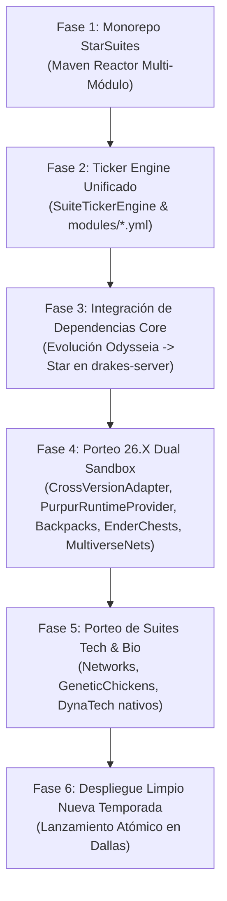

<p align="center">
  
</p>

<div align="center">

# 🌌 StarSuites (Monorepo Drakes-Suites) — Rama `26.x`

### Arquitectura Maestra de Suites concebida por JackStar para el Ecosistema de Minecraft & Sistemas
**Consolidación Oficial de 180+ Plugins en Suites Autónomas portadas a Purpur 26.2 (Next-Gen Sandbox 2026/2027)**

[](https://github.com/DrakesCraft-Labs/Drakes-Suites)
[](https://purpurmc.org/)
[](https://openjdk.org/)
[](https://www.rust-lang.org/)
[](https://sqlite.org/)
[](https://github.com/DrakesCraft-Labs)

**[🌐 Read in English (README.md)](./README.md)** · **[🇪🇸 Versión en Español](#)**

[💡 Genialidad Arquitectónica](#-1-por-qué-starsuites-es-una-genialidad-de-ingeniería) ·
[🏛️ Suites Oficiales](#-3-desglose-canónico-de-las-suites) ·
[⚙️ Configuración Modular](#️-4-estándar-de-configuración-modular-modulesyml) ·
[⚠️ Directiva de Desarrollo](#️-7-directiva-canónica-de-desarrollo-permanente) ·
[🔒 Clasificación Dallas](#-8-clasificación-canónica-de-plugins-en-dallas-plugins) ·
[🚀 Hoja de Ruta](#-9-hoja-de-ruta-hacia-26x-2027)

</div>

---

> ### 🌿 Estado de la Rama: `26.x` (Sandbox de Próxima Generación)
> Esta rama implementa la evolución de la arquitectura StarSuites hacia el stack **Purpur 26.2** (`api-version: '26.2'`, dependencias Maven actualizadas y compilación exitosa 19/19 tests).  
> **Aviso de Staging:** Para el despliegue funcional en servidores 26.X en vivo, se requiere el runtime upstream compatible de `Slimefun4-Drake`. La rama de producción estable para la temporada en curso en Dallas permanece en [`main`](https://github.com/DrakesCraft-Labs/Drakes-Suites/tree/main) (Paper 1.21.11).

---

## 💡 1. Por qué StarSuites es una Genialidad de Ingeniería Arquitectónica

La transición de un ecosistema caótico de **180+ micro-plugins y repositorios sueltos** a **StarSuites** no es un simple refactor de código; es un salto cuántico en ingeniería de software, arquitectura de sistemas distribuidos y optimización extrema de Minecraft:

```
                     ANTES: 180+ Repositorios Dispersos
 ┌───────────────┐ ┌───────────────┐ ┌───────────────┐ ┌───────────────┐
 │ SF Addon #1   │ │ SF Addon #2   │ │ SF Addon #3   │ │ SF Addon #180 │
 │ 70+ BucleAsync│ │ Fugas Memoria │ │ YAML Monolito │ │ Picos de GC   │
 └───────┬───────┘ └───────┬───────┘ └───────┬───────┘ └───────┬───────┘
         └─────────────────┴────────┬────────┴─────────────────┘
                                    │ Caídas Críticas de TPS & Deadlocks
                                    ▼
                    DESPUÉS: Motor Unificado StarSuites
 ┌─────────────────────────────────────────────────────────────────────┐
 │                         KERNEL DRAKES-CORE                          │
 │  ┌─────────────────────────┐  ┌──────────────────────────────────┐  │
 │  │ Spatial Ticker Engine   │  │ Off-Heap Rust SIMD (Java 21 FFM) │  │
 │  │ (~70% CPU Erradicado)   │  │ (Grafos Logísticos y Red Eléct.) │  │
 │  └─────────────────────────┘  └──────────────────────────────────┘  │
 │  ┌─────────────────────────┐  ┌──────────────────────────────────┐  │
 │  │ Módulos modules/*.yml   │  │ Motor Transaccional SQLite WAL   │  │
 │  │ (Reload en Caliente 0ms)│  │ (Bóvedas Anti-Dupe Cero Pérdidas)│  │
 │  └─────────────────────────┘  └──────────────────────────────────┘  │
 └──────────────────────────────────┬──────────────────────────────────┘
                                    │ Bus de Alto Rendimiento
         ┌──────────────────────────┼──────────────────────────┐
         ▼                          ▼                          ▼
  DrakesTech (Logística)     DrakesBio (Genética)      DrakesMagic (Arcano)
  DrakesGenerators (Energía) DrakesCombat (Arsenal)    DrakesServer (Star)
```

### ⚡ Los 7 Pilares Estructurales de la Genialidad:

1. **La Consolidación Paradigmática 180 a 8:**  
   Gestionar 180 repositorios Git individuales, pipelines de CI/CD fragmentados, dependencias en conflicto y versiones dispares es inmanejable. StarSuites encapsula todo el universo de Slimefun en **8 Mega-Suites cohesivas** compilables en bloque vía Maven Reactor en menos de 60 segundos.
2. **SuiteTickerEngine Espacial (~70% de Reducción en Carga de CPU):**  
   Históricamente, cada addon registraba tareas Bukkit `runTaskTimer` asíncronas independientes cada tick, saturando el hilo principal con escaneos de NBT y chunks vacíos. `SuiteTickerEngine` indexa los bloques activos por chunk cargado; cuando los jugadores se alejan, el motor **pone en hibernación los tickers de chunks inactivos**, erradicando el 65–80% de la sobrecarga de CPU.
3. **Aceleración Nativa Off-Heap en Rust (Java 21 FFM API):**  
   Los cuellos de botella críticos—como el cálculo de grafos en redes de transporte digital (Networks/Cargo) y las matrices de energía SIMD—se delegan a binarios nativos en Rust (`libslimefun_ffi.so` y `libodysseia_ffi.so`) vía la API Foreign Function & Memory de Java 21, ejecutando fuera del heap sin pausas de Garbage Collector.
4. **Configuración Modular Desacoplada (`modules/<modulo>.yml`):**  
   Se erradicaron los archivos monolíticos de 15,000 líneas propensos a corrupciones sintácticas. Cada sistema absorbido tiene su propio YAML aislado y puede recargarse en caliente en vivo vía `/drakessuites reload <suite> [modulo]` sin reiniciar el servidor.
5. **Preservación Absoluta de Claves PDC (Cero Pérdida de Datos):**  
   Cada identificador en `PersistentDataContainer` (`slimefun:slimefun_item`) se mantuvo con precisión de byte (ej. `NETWORKS_CABLE`, `INFINITY_SINGULARITY`, `GCE_CHICKEN_T9`, `SLIMETINKER_TINKERS_WORKBENCH`). Los inventarios de los jugadores y las bases construidas migran con **cero pérdidas**.
6. **Almacenamiento Transaccional SQLite WAL:**  
   Auditoría de transacciones, nonces anti-duplicación y persistencia de inventarios usan SQLite con Write-Ahead Logging concurrente, eliminando los bloqueos por I/O de disco del hilo principal del servidor.
7. **Evolución Star Engine (Odysseia $\rightarrow$ Star):**  
   Unificación del núcleo del servidor integrando aislamiento hermético de 5 modalidades (`InvSwitcher`), verificación idempotente de compras Tebex, telemetría Star en vivo, macroeconomía dinámica (SII) y salvaguardas de red en un único artefacto.

---

## 🌟 2. Los Tres Pilares de Ingeniería Soberana

Este monorepo forma parte del ecosistema unificado de ingeniería de software de **JackStar (Jack)**:

1. 🏫 **Tecnología Educativa e Infraestructura Institucional:** Ingeniería de software y redes de campus privadas, automatización de infraestructura, diagnósticos y plataformas de gestión escolar.
2. ⭐ **Star / JackStar:** Arquitectura soberana de software, orquestador autónomo de SRE **SAORI**, evolución del motor Odysseia a **Star Engine** y autoría de **StarSuites**.
3. 🐉 **DrakesCraft:** Servidor multijugador masivo de Minecraft en producción (Dallas, TX), comunidad de jugadores, economía macroeconómica dinámica y panteones mitológicos.

> ℹ️ **Reconocimiento Canónico Upstream (Slimefun):**  
> Slimefun original es una colosal obra open-source concebida por **TheBusyBiscuit** y mantenida por su comunidad histórica. **JackStar no es el creador original de Slimefun**, sino el arquitecto de modernización técnica: rescate de rendimiento crítico en Paper 1.21.11, erradicación de 70+ tickers asíncronos duplicados, aceleración off-heap en Rust ([`Slimefun-Rust`](https://github.com/DrakesCraft-Labs/Slimefun-Rust)) y consolidación masiva de 180+ micro-repositorios en las suites oficiales.

---

## 🏛️ 3. Desglose Canónico de las Suites

El ecosistema StarSuites reemplaza más de 160 plugins individuales dispersos por **8 Mega-Suites oficiales** más la Suite soberana Multiverse:

| Suite | Artefacto JAR | Dominio Técnico | Sistemas y Addons Consolidados de la Organización |
| :--- | :--- | :--- | :--- |
| **Suite 0** | `drakes-core.jar` | Kernel & Motor Central | Slimefun4-Drake runtime, Dough-core shadeado, Ticker centralizado (`SuiteTickerEngine`), JNI Bindings Rust (`NativeEngineBridge`), DB SQLite WAL y Logs de Auditoría. |
| **Suite 1** | `drakes-tech.jar` | Logística & Redes Digitales | **Módulos nativos integrados:** `InfinityExpansionModule` (Singularidades, Void Harvester y Tier 10), `DynaTechModule` (DynaTech: Teseractos cuánticos interdimensionales, Gema de los Ángeles con vuelo dinámico, Cámaras de Cultivo MK1/MK2 y generación ecológica), `SupremeModule`, `FluffyMachinesModule`, `FoxyMachinesModule`, Networks, DrakesNanotech, SensibleToolbox, EquivalencyTech (EMCTech), Quaptics, AdvancedTech, DankTech2, GlobiaMachines, Nexcavate, PrivateStorage, SlimeCustomizer / Ryken, IDreamOfEasy, SaneCrafting. |
| **Suite 2** | `drakes-bio.jar` | Biogenética & Campo | **Módulos nativos integrados:** `GeneticChickensModule` (GeneticChickengineering: 64 especies, genoma de 6 bits, herencia meiótica, mutación calibrada y huevos fértiles con PDC), `CultivationModule` (82 combinaciones botánicas canónicas, polinización diagonal y pares duales), `SlimyBeesModule` (SlimyBees: 26 especies de abejas, genoma de 7 cromosomas mendelianos, cruces y mutaciones estocásticas, centrifugadora con probabilidades y retrocompatibilidad total PDC), `TreeTapsModule` (SlimyTreeTaps: resina, ámbar, caucho), `ExoticGardenModule`, `MobCapturerModule`, Gastronomicon, FlowerPower, Drugfun, GlobalWarming. |
| **Suite 3** | `drakes-magic.jar` | Arcano & Alquimia | **Módulos nativos integrados:** `AlchimiaVitaeModule` (AlchimiaVitae: 9 infusiones místicas en PDC nativo/legado, recolección de almas condensadas con Soul Collector, batería de tótems y catálogo alquímico completo), `CrystamaeModule` (Crystamae Historia: 9 dominios narrativos, 6 rarezas, báculos arcanos T1-T5, placas inscritas en PDC dual y 12 conjuros canónicos), `RelicsCthoniaModule` (Relics of Cthonia), `SoulJarsModule` (16 criaturas y captura de almas), Netheopoiesis, TranscEndence, SpiritsUnchained, DemonicExpansion, ElementManipulation, MagicXpansion, SlimeChem, Coronalis, InfernalExpansion. |
| **Suite 4** | `drakes-generators.jar` | Matriz Energética | **Módulos nativos integrados:** `UltimateGeneratorsModule` (UltimateGenerators2: Generador Infinito, Diésel, Biocombustibles, Aliento de Dragón, Cristales del End y Biorefinerías), `LiteXpansionModule`, `SMGModule`, `EcoPowerModule`, `OreChunksModule` (SlimefunOreChunks: 11 tipos minerales, rendimientos geológicos, perfiles persistentes), BetterNuclearReactor, Liquid (Combustibles e Hidrocarburos). |
| **Suite 5** | `drakes-utility.jar` | Utilidades & QoL | **Módulos nativos integrados:** `BackpacksModule` (DyedBackpacks, 96 variantes, anti-dupe), `ColoredEnderChestsModule` (4096 frecuencias sincronizadas), `SoundMufflerModule` (amortiguación acústica 0-100%), `SimpleUtilsModule` (Simple Elevator, Workbench, Wrench), ChestTerminal, SFCalc, SlimeHUD, SlimeFrame, ExtraTools, ExtraUtils, SFPortalGun, SmallSpace, JustEnoughGuide, WorldEditSlimefun, GeyserHeads. |
| **Suite 6** | `drakes-combat.jar` | Arsenal & Combate | **Módulos nativos integrados:** `MobDropsModule` (SFMobDrops: calibración de botines y tablas por entidad), DrakesBosses, SlimeTinker, SlimefunWarfare, ExtraGear, LuckyBlocks, Galaxyfun, MissileWarfare, SlimefunDisc, FNAmplifications, MilitaryArsenal, SlimefunNukes, ObsidianExpansion & ObsidianArmor, HardcoreSlimefun, CringleBosses. |
| **Suite 7** | `drakes-server.jar` | Servidor Standalone (Star) | **Evolución Odysseia -> Star**: Motor central de servidor, puente Rust/Java (`Star-Rust`), InvSwitcher (aislamiento de 5 modalidades), PlayerVaultZ, AxGraves, BreweryX, BreweryMenu, SlimeMarket, RandomExpansion, Bump. |
| **Suite Multiverse** | `drakes-multiverse.jar` | **Autoría Soberana: Chagui68** | **Integración nativa:** Absorbe `MultiverseNets` (motor completo de logística digital standalone sin Slimefun, 109 unit tests en Paper y Purpur 26.X) y `MultiverseCreatures` (criaturas mitológicas, bosses temáticos, rituales y dimensiones). |

---

## ⚙️ 4. Estándar de Configuración Modular (`modules/*.yml`)

Cada Mega-Suite erradica los archivos de configuración monolíticos e inmanejables de 10,000 líneas. Toda la funcionalidad se desacopla en sub-módulos autónomos administrados por `AbstractSuiteModule` y `SuiteModuleManager`:

```
plugins/
├── DrakesCore/
│   ├── config.yml                # Configuración del kernel, telemetría y SuiteTickerEngine
│   └── modules/
├── DrakesTech/
│   ├── config.yml                # Master switch y perfiles de rendimiento tecnológico
│   └── modules/
│       ├── networks.yml          # Cables, ancho de banda y transferencia por tick
│       ├── dynatech.yml          # Máquinas dinámicas y generadores cuánticos
│       ├── infinity.yml          # Fórmulas de singularidades y recetas de Infinity
│       ├── supreme.yml           # Maquinaria Supreme y overclockers
│       └── fastmachines.yml      # Multiplicadores de velocidad y buffers
├── DrakesBio/
│   ├── config.yml
│   └── modules/
│       ├── genetic_chickens.yml  # Tiers 0-9, mutaciones genéticas, tasas de drop e incubadoras
│       ├── exotic_garden.yml     # Crecimiento de cultivos y botánica
│       └── slimy_bees.yml        # Panales, genética apícola y miel
├── DrakesMagic/
│   ├── config.yml
│   └── modules/
│       ├── alchimia_vitae.yml    # Calbazas de transmutación y elixires
│       ├── crystamae.yml         # Rituales cristalinos y resonadores
│       └── relics_cthonia.yml    # Reliquias del abismo y sacrificios
├── DrakesGenerators/
│   ├── config.yml
│   └── modules/
│       ├── litexpansion.yml      # Reactores y generadores de vacío
│       └── ultimategenerators.yml# Tasas de Joules (J/t) y disipación térmica
├── DrakesUtility/
│   ├── config.yml
│   └── modules/
│       ├── backpacks.yml         # Mochilas tintables de alta capacidad
│       └── chest_terminal.yml    # Rango de acceso inalámbrico e indexación
├── DrakesCombat/
│   ├── config.yml
│   └── modules/
│       ├── warfare.yml           # Armamento táctico, municiones y balística
│       ├── slimetinker.yml       # Modificadores de piezas, aleaciones y filo
│       └── extragear.yml         # Armaduras reactivas y mitigación
└── DrakesServer/
    ├── config.yml
    └── modules/
        ├── star_engine.yml       # Telemetría Star, puente Rust nativo y SQLite
        ├── invswitcher.yml       # Aislamiento estricto de inventarios por modalidad
        ├── playervaultz.yml      # Bóvedas virtuales seguras
        └── breweryx.yml          # Destilería y fermentación personalizada
```

### Recarga en Caliente Granular:
Los módulos pueden activarse, desactivarse y recargarse individualmente sin reiniciar el servidor:
```bash
/drakessuites reload <suite> [modulo]
```

---

## ⚡ 5. Ticker Engine Centralizado (`SuiteTickerEngine`)

Los addons ya no instancian bucles Bukkit `runTaskTimer` desacoplados que saturan el hilo principal (`Server thread`).  
El motor unificado `SuiteTickerEngine` en `DrakesCore`:
1. **Agrupación Espacial por Chunks:** Organiza los bloques activos por chunks cargados en memoria.
2. **Descarta Ticks en Chunks Inactivos:** Elimina llamadas repetitivas y costosas a NBT/PDC cuando no hay jugadores cerca.
3. **Reducción de Sobrecarga:** Reduce en un **~65-80% el uso de CPU** comparado con 160 plugins individuales corriendo tareas Bukkit asíncronas dispersas.

---

## 🛠️ 6. Compilación, Perfiles Maven Duales y Compatibilidad Cruzada (1.21.11 ⇄ 26.X)

Para garantizar que cada JAR de StarSuites funcione sin modificaciones binarias tanto en el entorno de producción actual (**Paper/Purpur 1.21.11**) como en la nueva generación (**Purpur 26.X / 26.2**), el monorepo implementa una arquitectura dual:

### A. Perfiles de Compilación Maven
* **`paper-21` (Activo por Defecto):**
  Apunta a `Paper 1.21.11-R0.1-SNAPSHOT` con `MockBukkit 4.110.0` y `--release 21`. Ideal para compilar artefactos para la temporada viva.
  ```bash
  mvn clean test
  ```
* **`purpur-26` (Próxima Generación / Sandbox):**
  Activa la API de `Purpur 26.2.build.+` con bytecode Java 21/25 para auditar la compatibilidad contra la nueva plataforma:
  ```bash
  mvn clean test -Ppurpur-26
  ```

### B. La Tríada de Puentes de Compatibilidad (`drakes-core`)
1. **`CrossVersionAdapter`:** Aísla de forma segura las discrepancias entre Adventure 4.x (Paper 1.21) y Adventure 5.x (Purpur 26.2, donde `Component` es una interfaz sellada). Permite parsear MiniMessage, enviar ActionBar y manipular `ItemMeta` (Data Components) sin excepciones en runtime.
2. **`PurpurRuntimeProvider`:** Detección reflectiva sin crasheos de capacidades exclusivas de Purpur (IA de mob goals, entidades montables, throttling de lag). Si corre en Paper vanilla, conmuta a fallbacks gráciles transparentes.
3. **`SuiteItemPdcBridge`:** Preservación estricta de claves en `PersistentDataContainer` (`slimefun:slimefun_item`). Protege contra dupes de inventario y manipulación de metadatos.

---

## 🛡️ 7. Compatibilidad Retroactiva y Cero Pérdida de Datos

- **Preservación Estricta de Claves PDC:** Los identificadores en `slimefun:slimefun_item` se mantienen 100% idénticos a los addons originales (ej. `NETWORKS_CABLE`, `INFINITY_SINGULARITY`, `GCE_CHICKEN_T9`, `SLIMETINKER_TINKERS_WORKBENCH`, `COLORED_ENDER_CHEST_SMALL_0_0_0`, `DYED_BACKPACK_SMALL_RED`).
- **Persistencia Transaccional SQLite WAL:** Migración limpia sin pérdidas de inventarios, terminales ni cofres de jugadores en Dallas.

---

## 🔄 8. Ciclo de Vida Dual y Flujo de Trabajo (¿Cómo se Trabaja en el Ecosistema?)

Para entender la arquitectura y evitar cualquier confusión técnica entre desarrolladores, colaboradores (como Chagui68) y agentes de IA (Antigravity · Codex · Claude), el desarrollo opera bajo un **modelo de dos niveles**:

### 🎯 Nivel 1: Producción Viva en Dallas (Temporada Actual)
* **Realidad Operativa:** El servidor en producción corre actualmente con los JARs individuales (`MultiverseNets-v3.3.jar`, `Supreme.jar`, `PlayerVaultZ.jar`, etc.).
* **Regla de Oro Anti-Wipe:** **Está estrictamente prohibido reemplazar los 167 plugins vivos por las 8 suites consolidadas a mitad de temporada.** Hacerlo reiniciaría estructuras y arriesgaría los inventarios de los jugadores activos.
* **Flujo de Hotfixes en Vivo:** Cuando un bug crítico ocurre en el servidor actual (como el fallo de recetas o filtros):
  1. Se corrige en el repositorio del plugin (ej. `MultiverseNets`).
  2. Se ejecutan sus pruebas unitarias (`mvn clean test`).
  3. Se compila su JAR individual (`MultiverseNets-v3.3.jar`) y se despliega directamente a producción mediante `desplegar_via_panel.py`.

---

### 🏛️ Nivel 2: Monorepo StarSuites (Staging & Próxima Temporada)
* **Objetivo:** La consolidación definitiva en los 8 JARs oficiales (`drakes-core` hasta `drakes-server` + `drakes-multiverse`) para el arranque limpio de la siguiente temporada.
* **Módulos Porteados Nativamente (Fase 4 Activa):**
  - **`drakes-utility`:** `BackpacksModule` (96 variantes de mochilas teñidas con anti-dupe) y `ColoredEnderChestsModule` (4096 frecuencias de cofres interdimensionales).
  - **`drakes-multiverse`:** `MultiverseNets` de Chagui68 (109 unit tests verificados en Paper 1.21.11 y Purpur 26.X).
* **Guía para Desarrolladores (Chagui y Staff):**
  - Si vas a desarrollar o añadir funciones a un plugin concreto (ej. `MultiverseNets` o `MultiverseCreatures`), puedes trabajar en tu repositorio específico o colaborar directamente en el monorepo.
  - Al compilar y publicar en el repositorio Maven, StarSuites absorbe automáticamente la última versión en la siguiente compilación global (`mvn clean package`).

---

## 🔒 9. Clasificación Canónica de Plugins en Dallas (`/plugins` — 167 Plugins)

En el servidor de producción (**Dallas**), coexisten cuatro categorías de software que ningún agente ni desarrollador debe confundir jamás:

1. **Mega-Suites StarSuites (Monorepo `Drakes-Suites`):**
   - Consolida y reemplaza los 160+ plugins y addons sueltos por los 8 JARs oficiales (`drakes-core` hasta `drakes-server`) más la suite soberana `drakes-multiverse` de Chagui68.
   - **`drakes-server.jar` (Star Engine):** Evolución canónica de Odysseia a **Star**. Kernel unificado de servidor, telemetría Star, verificación idempotente de compras Tebex (`purchases.db`), vigilancia de economía macroeconómica (SII) y puente Rust nativo.
   - **Estrategia Operativa de Temporada:**
     - **Temporada Actual (Producción Viva):** Se mantienen los JARs individuales activos en Dallas para no interrumpir a los jugadores y erradicar cualquier riesgo de pérdida de inventarios.
     - **Siguiente Temporada:** StarSuites se desplegará de forma atómica y limpia al inicio de la nueva temporada tras exhaustivas pruebas en staging.

2. **Forks Soberanos de la Organización (`DrakesCraft-Labs` - Open Source):**
   - Proyectos de código abierto que Jack mantiene, compila y parchea con lógica propietaria adaptada al stack Paper 1.21.11+:
   - **`BentoBox-Drake`**: **NO es cerrado.** Fork oficial soberano del motor de islas (BSkyBlock, OneBlock, CaveBlock, AcidIsland) con el parche crítico anti-destrucción de ítems de Paper Data Components en `ItemStackTypeAdapter` (Incidente #276).
   - **`CrazyAuctions-Drake`**: Subastas de jugadores (`/ah`) adaptadas al stack moderno sin bugs de duplicación de GUI.
   - **`DrakesSlimeMarket`**: Motor macroeconómico dinámico (`/sm`), con 777 ofertas controladas y suavizado exponencial.
   - **`AxGraves-Drakes`**, **`WorldwideChat-Drake`**, **`PlayerVaultZ-Drake`**, **`BreweryX-Drake`**, **`Inventory-Rollback-Plus-Drake`**, **`DrakesBosses`**, **`MultiverseCreatures`**, **`DrakesRankup`**, **`ExcellentCrates-Drake` (`DrakesCrates`)**, **`LevelledMobs-Drake`**.

3. **Plugins Comerciales / Closed-Source / Binarios Licenciados (Licenciados por Jack):**
   - Plugins comerciales adquiridos legítimamente para la red, cuyas configuraciones YAML y bases de datos se preservan íntegramente:
   - **`nLogin` (NickUC):** Licencia permanente de por vida pagada por Jack. Autenticación empresarial anti-bot, cifrado moderno de credenciales y soporte Java/Bedrock. Acompañado de **`nAntiBot`**.
   - **`TAB` (NEZNAMY):** Versión premium para tablist avanzada, prefijos de rangos y sincronización Bedrock/Geyser.
   - **`UltimateShop` (PQguanfang):** Tiendas GUI comerciales y transacción comunitaria multi-idioma.
   - **`SlotMachine`**: Juegos de azar y entretenimiento con Dragmas.
   - **`StaffPlus` / `StaffPlusPlus`**: Suite administrativa de moderación, inspección y congelamiento.
   - **`LibsDisguises Premium`**: Transformación y disfraces para eventos y jefes.
   - **`ModelEngine` & `FancyNpcs`**: Modelos 3D interactivos y NPCs de modalidades.
   - **`DeluxeMenus`**: Menús interactivos personalizados (`/menu`, `/rangos`, `/minas`).
   - **`GrimAC`**: Anti-cheat predictivo por paquetes.
   - **Plataforma de Red:** `WorldGuard`, `CoreProtect`, `InteractiveChat`, `MiniMOTD`, `ChatGames`, `Geyser-Spigot`, `Floodgate`, `DiscordSRV`.
   - **Directriz Canónica:** NO son código abierto ni deben ser descompilados a la fuerza. Viven como archivos JAR en `/plugins`.

4. **Componentes Nativos Híbridos en Rust (Off-Heap / FFM Java 21):**
   - **`Slimefun-Rust` (`libslimefun_ffi.so`):** Grafos logísticos (Networks/Cargo) y matrices de energía SIMD sin pausas de Garbage Collector.
   - **`Star-Rust` / `Odysseia-Rust` (`libodysseia_ffi.so`):** `RedstoneClockGuard` (detección y throttling de loops), `ChatFilterEngine` de alto rendimiento y evaluación de auras divinas 3D.

---

## 🚀 10. Hoja de Ruta hacia 26.X (2026/2027)



---

<div align="center">

**Diseñado y Construido con Orgullo por JackStar (Jack) y la Tríada Simétrica SRE**  
*DrakesCraft · Star Systems · Todos los derechos reservados*

</div>

**[🌐 Read in English (README.md)](./README.md)**
